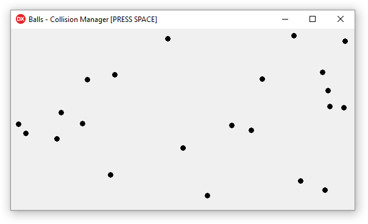
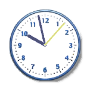
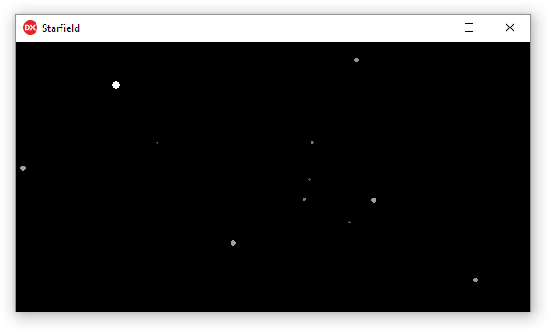
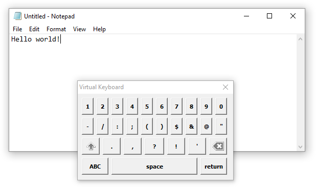

# Experiments in Delphi

An assortment of Delphi based coding experiments, which are mostly considered alpha, not optimized, and have incomplete features.

#### Balls - Collision Manager

A simple 2D collision manager that aims to optimize the detection of object collision.

#### Clock

An analogue desktop clock application.

#### Starfield

A simulation of stars travelling towards the screen.

#### Virtual Keyboard

A virtual keyboard simulator that uses Win32 to communicate and send key strokes to other applications.

## License

Experiments in Delphi is licensed under the MIT License. See [LICENSE](LICENSE.md) for details.
